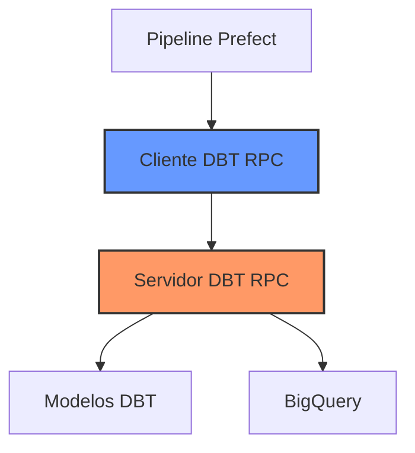
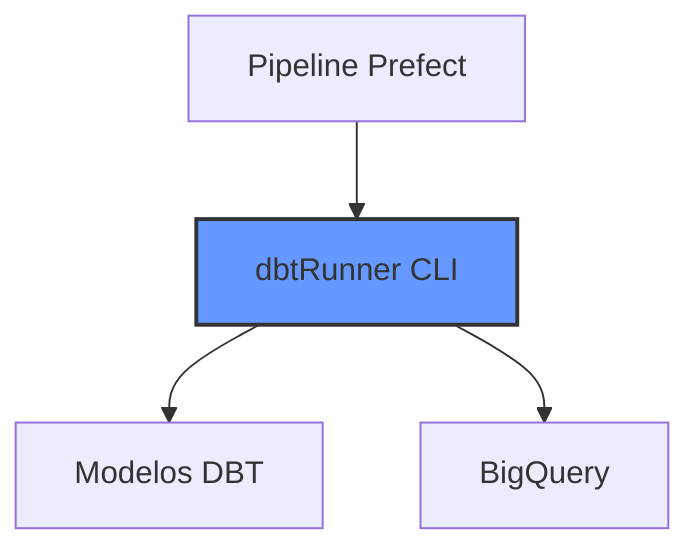
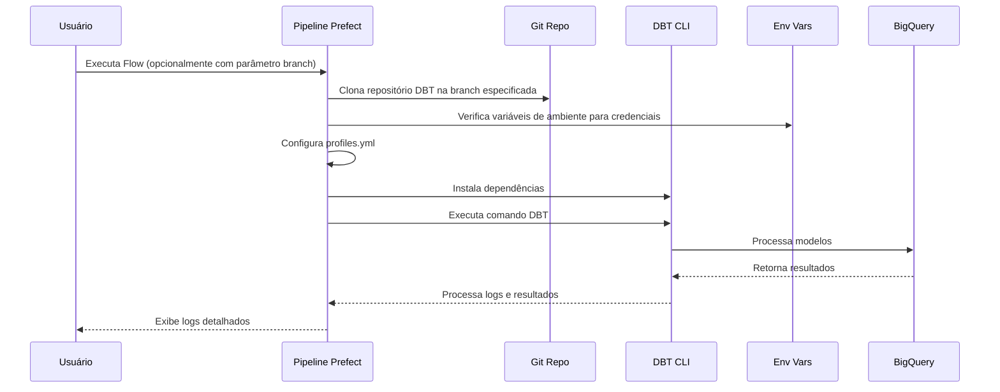
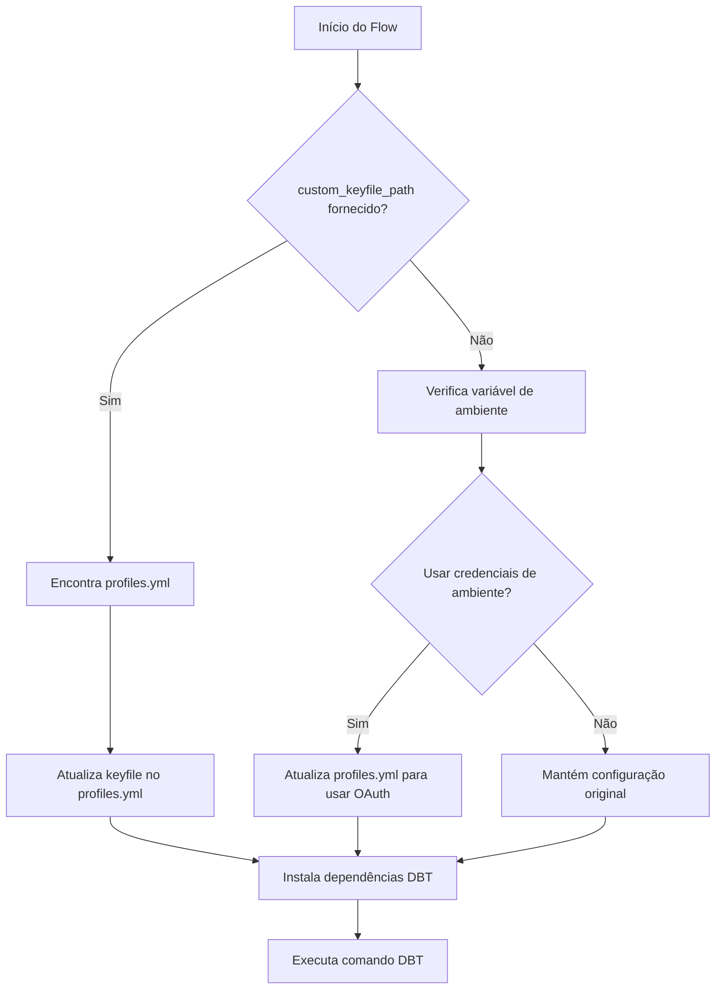
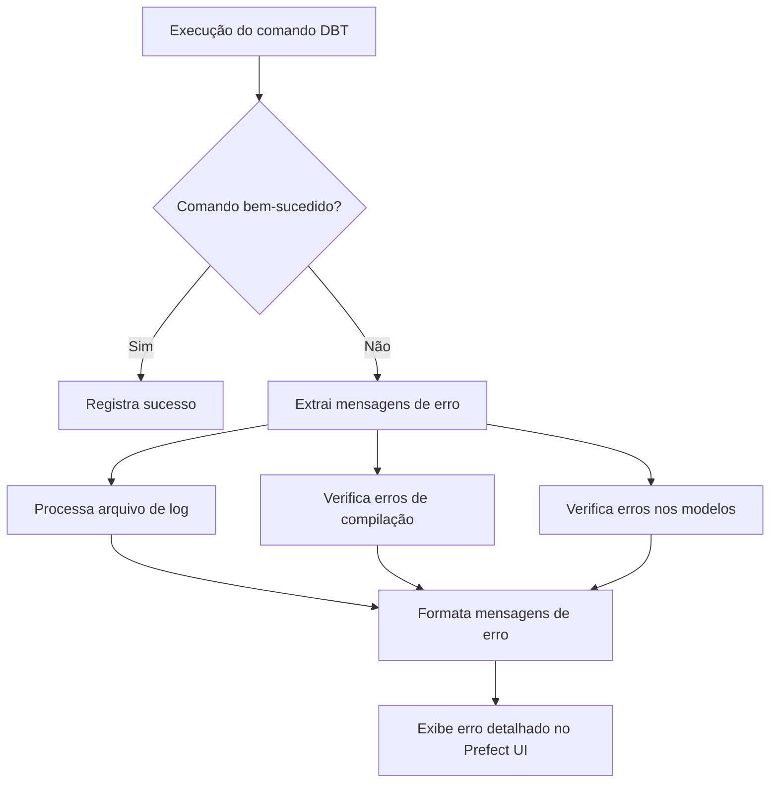

# ADR-0001 — Migração da integração DBT de servidor RPC para CLI direta

## Contexto

A integração do **DBT (Data Build Tool)** com as pipelines do Prefect era feita através de um **servidor DBT-RPC** em execução contínua. As pipelines se conectavam ao servidor através de um cliente intermediário, e toda a comunicação entre o orquestrador e o DBT passava por essa camada RPC.

### Arquitetura anterior

Esse desenho trazia atrito operacional:

- Servidor DBT-RPC sempre-ligado, com seu próprio ciclo de deploy e monitoramento.
- Servidor opera sobre uma versão fixa do projeto, dificultando teste de modelos em branches em desenvolvimento.
- Necessidade de manter arquivos de credenciais persistidos em disco no servidor RPC.
- Logs e resultados ficavam no servidor RPC, não no pipeline que originou a chamada — debugging indireto.

## Decisão

Eliminar a camada intermediária RPC e invocar o DBT **diretamente via CLI** dentro do flow do Prefect, usando `dbtRunner`.

### Arquitetura nova

### Fluxo de execução

Etapas:

1. Usuário inicia o flow Prefect, podendo especificar uma branch.
2. O repositório DBT é clonado localmente na branch especificada.
3. Credenciais são resolvidas via variáveis de ambiente.
4. `profiles.yml` é configurado (credenciais de ambiente ou arquivo personalizado).
5. Dependências DBT instaladas localmente.
6. Comandos DBT executados diretamente via CLI.
7. Logs e resultados processados e apresentados ao usuário.

### Autenticação e credenciais

Opções suportadas:

- `custom_keyfile_path` — caminho para credenciais locais (uso de desenvolvimento).
- `_update_profiles_for_env_credentials` — configura `profiles.yml` para usar OAuth com variáveis de ambiente.
- `use_env_credentials` (padrão: `True`) — controla se a autenticação usa credenciais de ambiente.
- O sistema detecta automaticamente o tipo de autenticação a aplicar.

### Tratamento de erros

Características:

- Extração de erros de múltiplas fontes no resultado do DBT.
- Processamento do arquivo de log para obter informações detalhadas.
- Mensagens formatadas, erros numerados e em linhas separadas.
- Inclusão de contexto adicional (comando executado, diretório de trabalho).
- Exibição na interface do Prefect.

## Consequências

### Positivas

- **Infraestrutura significativamente mais simples**: deixa de existir um componente sempre-ligado para manter, deployar e monitorar.
- **Flexibilidade de branch**: o flow pode invocar o DBT contra qualquer branch/versão do projeto, viabilizando testes de modelos em desenvolvimento.
- **Logs e resultados no próprio pipeline**: o output fica acoplado à execução do flow, simplificando debugging e auditoria.
- **Maior segurança**: elimina a necessidade de manter arquivos de credenciais persistidos em disco no servidor RPC; suporte a OAuth via env vars.
- **Tratamento de erros melhorado**: erros extraídos de múltiplas fontes (resultado do comando, arquivo de log, erros de compilação, erros nos modelos), com formatação clara na UI do Prefect.

### Negativas

- *(não documentadas no material original. Candidatas a investigar: maior tempo de cold-start por execução já que o DBT é invocado do zero a cada flow run; clone do repo Git a cada execução; menor reutilização de cache entre runs.)*

### Neutras

- Cada flow do Prefect que toca DBT precisa ser ajustado para usar o `dbtRunner` no lugar do antigo cliente RPC.
- Adoção de novos parâmetros de flow (`custom_keyfile_path`, `use_env_credentials`, branch).

## Alternativas consideradas

O material original não documenta alternativas formalmente consideradas além da migração de RPC para CLI. Possíveis alternativas que poderiam ter sido avaliadas (e não foram registradas):

- Manter o RPC e endurecer monitoramento/deploy.
- Usar uma solução de orquestração nativa do DBT (DBT Cloud).

## Status

Aceito e implementado. Última revisão da documentação original em 2025-03-18 por Gabriel Pisa.
