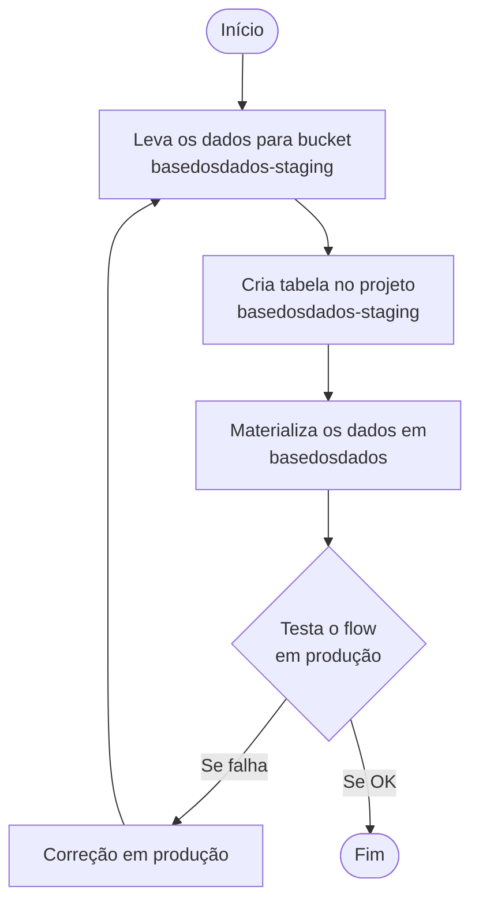
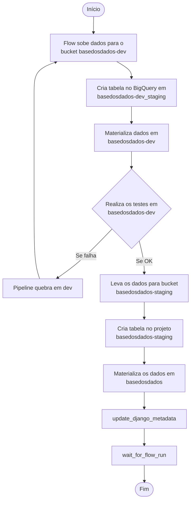

# ADR-0002 — Integrar pipelines com o ambiente de dev antes de promover para produção

## Contexto

Hoje, o teste de pipelines acontece **diretamente no ambiente de produção** — projeto `basedosdados` no BigQuery. Isso ocorre porque as pipelines estão configuradas para interagir apenas com o bucket e o projeto BQ de produção. Quando um teste DBT falha, o estrago já está em produção e a correção também precisa ser feita lá.

O ambiente `basedosdados` deveria ser apenas uma **réplica da versão mais recente dos dados já validados**, não um ambiente de teste.

### Fluxo antigo



## Decisão

Reorganizar o fluxo das pipelines para que **toda a etapa de testagem ocorra primeiro no ambiente de dev**. Os dados só são promovidos para produção se nenhum teste falhar. Em caso de falha, os dados ficam restritos ao ambiente de dev sem afetar produção.

### Fluxo integrado com ambiente de dev



### Estruturação da task

A primeira metade da task se mantém — a pipeline:

1. Sobe os dados para o bucket `basedosdados-dev`.
2. Cria a tabela em `basedosdados-dev_staging`.
3. Materializa os dados em `basedosdados-dev`.
4. Realiza os testes em `queries-basedosdados-dev`.

A segunda metade (promoção para produção) deve se parecer com a action `table-approve`, condicionada a uma checagem de sucesso da materialização em dev (sugestão de função: `check_materialization_state`, consultando a API do Prefect).

```python
with case(materialize_after_dump, True):
    materialization_flow = create_flow_run(
        flow_name=utils_constants.FLOW_EXECUTE_DBT_MODEL_NAME.value,
        project_name=constants.PREFECT_DEFAULT_PROJECT.value,
        parameters={
            "dataset_id": dataset_id,
            "table_id": table_id,
            "mode": "dev",  # primeira etapa — sempre dev
            "dbt_command": "run/test",
            "disable_elementary": False,
        },
        labels=current_flow_labels,
        run_name=r"Materialize {dataset_id}.{table_id}",
        upstream_tasks=[wait_upload_table],
    )

with case(check_materialization_state, True):
    # promoção para produção: replica em basedosdados-staging e materializa em basedosdados
    wait_upload_table = create_table_and_upload_to_gcs(...)
    materialization_flow = create_flow_run(
        ...,
        parameters={..., "mode": "prod"},  # segunda etapa — sempre prod
    )
    update_django_metadata(...)  # roda só ao final, após sucesso em prod
```

### Pontos abertos

- **Parâmetro de modo** — criar parâmetro indicando se o usuário quer rodar somente em dev ou executar a etapa completa (dev → prod).
- **`update_django_metadata`** — passa a rodar **apenas no final da task completa** (após sucesso em prod). Isso provavelmente torna o parâmetro `update_metadata` desnecessário.
- **`wait_for_flow_run`** — reavaliar. Hoje transmite estado e logs, mas os logs são pouco usados e poluem a execução do flow.
- **Condição `materialize_after_dump` na segunda etapa** — provavelmente pode ser removida, já que essa etapa só roda se os testes em dev passaram.
- **Labels** — para alterar labels de pipeline em `schedules`, é preciso entender melhor o processo de migração de `queries-basedosdados`/`queries-basedosdados-dev` para `pipelines`.

## Consequências

### Positivas

- Falhas de teste DBT ficam isoladas em dev — produção não é afetada.
- Produção volta a ser apenas réplica de dados validados, alinhando o ambiente ao seu propósito original.
- Correções deixam de exigir intervenção em produção.

### Negativas

- Aumento do número de etapas por pipeline (cria/materializa duas vezes — em dev e depois em prod).
- Aumento de custos de CPU/networking (pods k8s), storage e processamento BQ associados à etapa adicional.
- Maior superfície de código a manter no flow (lógica condicional `check_materialization_state`).

### Neutras

- Necessidade de definir critério programático de "sucesso da materialização em dev" antes de promover (via API do Prefect).
- A decisão de **manter ou não** os buckets/projeto de staging como parte do processo é tratada separadamente em [ADR-0003](0003-manter-staging-no-processo-de-dados.md).

## Alternativas consideradas

- **Manter testagem em produção** — descartada porque mantém o risco de poluir o ambiente que o produto consome.
- **Eliminar staging do processo de dados** (ver [ADR-0003](0003-manter-staging-no-processo-de-dados.md)) — avaliada e descartada por motivos de backup e governança.

## Status

Aceito — implementado. O flow `new_arch_pipeline` está consolidado em produção.
