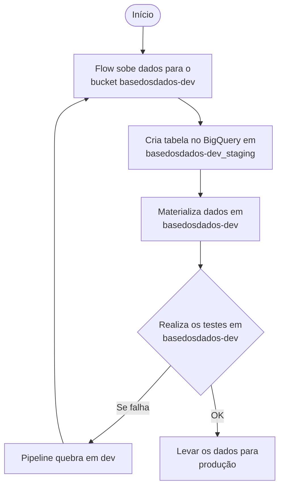

# ADR-0003 — Manter buckets e projeto de staging no processo de dados

## Contexto

Com a adoção do fluxo integrado com ambiente de dev (ver [ADR-0002](0002-pipeline-integrada-com-ambiente-dev.md)), passamos a refletir sobre se faz sentido continuar mantendo:

- o bucket `basedosdados-staging`, e
- o projeto `basedosdados-staging` no BigQuery

como integrantes do **processo de dados** das pipelines. A princípio, essa arquitetura é uma **herança** da forma como tabelas eram criadas no BQ no início da BD: usando *Views* conectadas ao Storage. Isso exigia um bucket com as tabelas para que o BQ fizesse a conexão e criasse as views.

Hoje só usamos **tabelas materializadas** — então o uso do storage para esse motivo específico não é mais necessário. Mantê-lo implica:

- maior consumo de recursos (CPU/networking nos pods do k8s, storage, processamento BQ);
- aumento da complexidade das pipelines (mais etapas).

### Fluxo sem interação com staging (alternativa avaliada)

## Decisão

**Manter** o bucket `basedosdados-staging` e o projeto `basedosdados-staging` do BigQuery como parte do processo de dados.

A decisão se baseia na avaliação de que **dois benefícios da arquitetura atual superam** os ganhos de redução de custo e complexidade que viriam da remoção.

## Consequências

### Positivas

- **Produção funciona como backup informal** — não temos política de backup ativa. A replicação completa de dev para produção via staging dá um nível de tolerância a falhas hoje inexistente em outros lugares.
- **Governança simples e barata** — manter staging como ambiente intermediário evita a obrigação de implementar um cronograma de backup formal sobre `basedosdados-dev`, que se tornaria o único repositório de dados brutos e semi-brutos da BD se staging fosse removido.
- **Dev permanece descartável** — com produção como réplica completa, dev pode ser usado para testagem extensiva sem preocupação com impactos downstream.

### Negativas

- Mantemos o aumento de etapas no processo de dados — além de criar tabelas e materializar em dev para testar, o flow precisa repetir o processo em produção (via staging).
- Custos extras de CPU/networking (pods k8s), storage e processamento BQ associados à transferência e replicação.
- A complexidade adicional permanece nas pipelines.

### Neutras

- A decisão pode ser revisitada se passarmos a ter uma política de backup formal — nesse caso, o argumento de "backup informal via produção" deixa de pesar.

## Alternativas consideradas

- **Eliminar staging do processo de dados** — descartada. Removeria a redundância de armazenamento que hoje funciona como backup, e exigiria uma política de governança/backup muito mais rígida e onerosa sobre `basedosdados-dev`.

## Status

Aceito. Substituível se uma política de backup formal for adotada e tornar a redundância via staging desnecessária.
