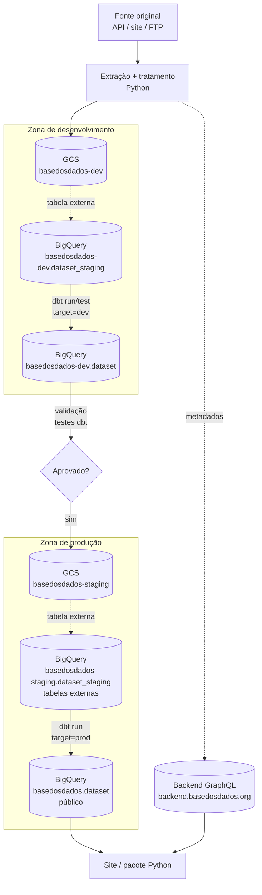
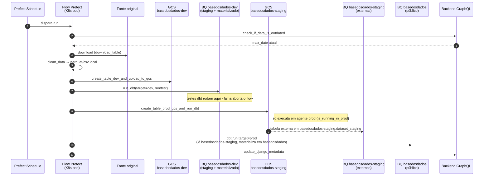
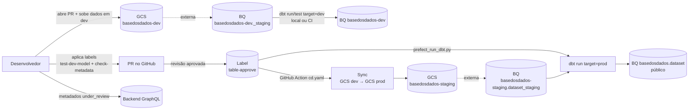

# Fluxo de dados e infraestrutura

Guia de onboarding com o retrato dos componentes de infraestrutura usados pela equipe dados e de como o dado se move entre eles, da fonte original até a publicação no projeto `basedosdados`.

> Este documento substitui, para uso interno, a [página de infraestrutura da BD](https://basedosdados.org/docs/colab_infrastructure#sistema-de-ingestão-de-dados), que está defasada.

## Componentes da infraestrutura

| Componente | Tecnologia | Papel |
|---|---|---|
| Orquestrador | [Prefect 1.x](https://docs-v1.prefect.io/) | Agenda e executa [pipelines](../glossario.md#p). Storage dos flows em GCS, runtime em Kubernetes. |
| Repositório de código | [`basedosdados/pipelines`](https://github.com/basedosdados/pipelines) | Hospeda flows Prefect, modelos dbt e a Action de deploy. |
| Storage — zona de dev | GCS bucket **`basedosdados-dev`** | Recebe os arquivos tratados pela pipeline (parquet/csv). |
| Storage — zona de prod | GCS bucket **`basedosdados-staging`** | Recebe os mesmos arquivos após validação, para produção. |
| Data warehouse — dev | BigQuery, projeto **`basedosdados-dev`** | Mesmo projeto guarda **as duas camadas**: `<dataset>_staging` (tabelas externas sobre o bucket `basedosdados-dev`) e `<dataset>` (modelos materializados pelo dbt). Usado pela equipe para validação. |
| Data warehouse — prod (staging) | BigQuery, projeto **`basedosdados-staging`** | Camada de tabelas externas (`<dataset>_staging`) sobre o bucket `basedosdados-staging`. **Não é exposto ao público.** |
| Data warehouse — prod (público) | BigQuery, projeto **`basedosdados`** | Modelos materializados pelo dbt a partir de `basedosdados-staging`. É o projeto consultado pelos usuários no site e no pacote Python. |
| Transformação e testes | [dbt](https://www.getdbt.com/) | Em dev: lê `basedosdados-dev.<dataset>_staging` e materializa em `basedosdados-dev.<dataset>` (`target=dev`). Em prod: lê `basedosdados-staging.<dataset>_staging` e materializa em `basedosdados.<dataset>` (`target=prod`) — projetos diferentes. |
| Metadados | API GraphQL Django — `backend.basedosdados.org` (prod) / `staging.backend.basedosdados.org` (staging) | Fonte da verdade dos metadados expostos no site e no pacote Python. |
| CI/CD | GitHub Actions | Deploy de flows para o Prefect e materialização em prod via label `table-approve`. |

## Visão geral do fluxo

A diferença entre [pipeline automatizada](../glossario.md#p) e [semi-automatizada](../glossario.md#p) está em **como** o portão "Aprovado?" é cruzado e **quem** dispara o `dbt run target=prod`.

## 1. Pipelines automatizadas (Prefect)

A pipeline roda no schedule definido em `schedules.py` e executa, num único flow, as duas zonas. Exemplo canônico: [`br_bcb_agencia`](https://github.com/basedosdados/pipelines/blob/main/pipelines/datasets/br_bcb_agencia/flows.py).

### Fluxo de execução

**Pontos importantes:**

- O mesmo flow grava em dev **e** prod. A separação é feita pela função `is_running_in_prod()` dentro de `create_table_prod_gcs_and_run_dbt` — só o agente Prefect de produção tem a credencial `/credentials-prod/prod.json` e por isso só ele materializa em `basedosdados`.
- `run_dbt(..., dbt_command="run/test")` em `target=dev` é o **gate de qualidade**: se um teste dbt falhar, o passo de prod não acontece.
- `update_django_metadata` atualiza coberturas temporais e flags (ex.: `bdpro_filter` para tabelas [BD Pro](../glossario.md#b)) via GraphQL no backend.

### Variante com múltiplas tabelas + dicionário

[`br_bcb_sicor`](https://github.com/basedosdados/pipelines/blob/main/pipelines/datasets/br_bcb_sicor/flows.py) ilustra o padrão "um flow por tabela + flow de dicionário", todos derivados de um template compartilhado (`br_bcb_sicor_template`). Cada tabela tem seu próprio `schedule`, mas todas usam o mesmo par `create_table_dev_and_upload_to_gcs` + `create_table_prod_gcs_and_run_dbt`. O flow `br_bcb_sicor.dicionario` segue exatamente o mesmo desenho descrito acima, mas com `dump_mode="overwrite"`.

## 2. Códigos semi-automatizados

[Pipelines semi-automatizadas](../glossario.md#p) são modelos dbt + script de carga executados manualmente pelo dev, com a materialização em produção disparada via label de PR.

### Passo a passo do colaborador

1. Baixar a pasta template e os dados originais.
2. Preencher as **tabelas de arquitetura** e marcar a equipe de dados na issue ao finalizar.
3. Escrever pipeline de carregamento dos dados (script Python que sobe arquivos para `basedosdados-dev`).
4. Subir as tabelas em `basedosdados-dev.<dataset>_staging` no BigQuery (tabela externa sobre o GCS).
5. Escrever modelos **dbt** para transformação em `models/<dataset>/`.
6. Escrever testes **dbt**.
7. Organizar arquivos auxiliares, se necessário.
8. Criar tabela `dicionario`, se necessário.
9. Preencher os metadados na API do backend, deixando a tabela como `under_review`.
10. Abrir o PR.
11. Aplicar as labels **`test-dev-model`** e **`check-metadata`** no PR.
12. Enviar para revisão.

### Deploy via `table-approve`

Quando a revisão aprova o PR, a label **`table-approve`** é aplicada. A GitHub Action [`cd.yaml`](https://github.com/basedosdados/pipelines/blob/main/.github/workflows/cd.yaml) detecta a label e executa o script `prefect_run_dbt.py`, que:

1. Sincroniza os arquivos do dev para o bucket `basedosdados` (cópia GCS → GCS).
2. Roda `dbt run target=prod` apenas para os modelos modificados no PR.

A diferença prática com a pipeline automatizada: o `dbt run target=prod` é disparado pela **Action**, não pelo flow Prefect, e o gatilho é humano (a label), não um schedule.

## 3. Preenchimento de metadados na API do backend

> **Antes de preencher qualquer metadado, leia o [Manual de estilo](../governanca/metadados/explicacao-manual-de-estilo.md).** Ele é a referência canônica para nomes de datasets/tabelas/colunas, tipos no BigQuery, formatos de data, padronização de UF/município e estrutura de diretórios. Sem aderência ao manual, os metadados ficam inconsistentes com o que está materializado em `basedosdados`, e a tabela é barrada na revisão.

A API GraphQL Django é a fonte da verdade dos metadados que aparecem no site e no pacote `basedosdados`. Endpoints:

- **Produção** — `https://backend.basedosdados.org/api/v1/graphql`
- **Staging** — `https://staging.backend.basedosdados.org/api/v1/graphql`

Pontos de contato a partir do código deste repositório:

- **`check_if_data_is_outdated`** (em pipelines automatizadas): consulta a `coverage` da tabela no backend para decidir se vale a pena rodar o flow.
- **`update_django_metadata`**: ao final do flow, atualiza `coverage` (com `time_delta`), define `coverage_type` (`all_free`, `all_bdpro`, `part_bdpro`) e o `bq_project` associado.
- **Fluxo semi-automatizado**: o colaborador edita a tabela direto no admin do backend, deixando-a `under_review` antes do PR. Após o deploy em prod, a tabela é marcada como `published`.

Para detalhes operacionais de cada operação no backend, consulte o domínio [Governança](../governanca/index.md) (a ser detalhado em runbooks específicos).

## Ver também

- [Setup do repositório de pipelines](setup-pipelines.md) — como preparar o ambiente antes de mexer em qualquer um destes fluxos.
- [Glossário](../glossario.md) — definições de **Pipeline**, **Pipeline semi-automatizada**, **BD Pro**.
- [`basedosdados/pipelines` — CONTRIBUTING.md](https://github.com/basedosdados/pipelines/blob/main/CONTRIBUTING.md) — referência operacional para o passo a passo do colaborador semi-automatizado.
- Domínio [Infraestrutura](../infraestrutura/index.md) — referências mais detalhadas por componente (buckets, projetos, agentes Prefect).
