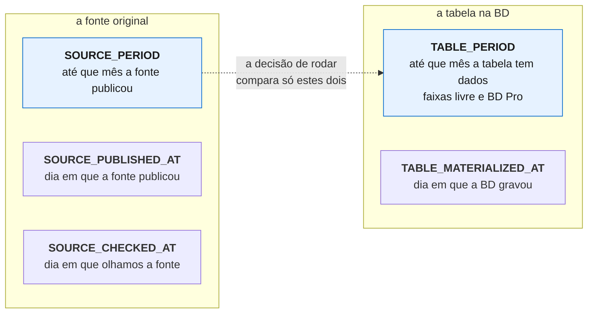
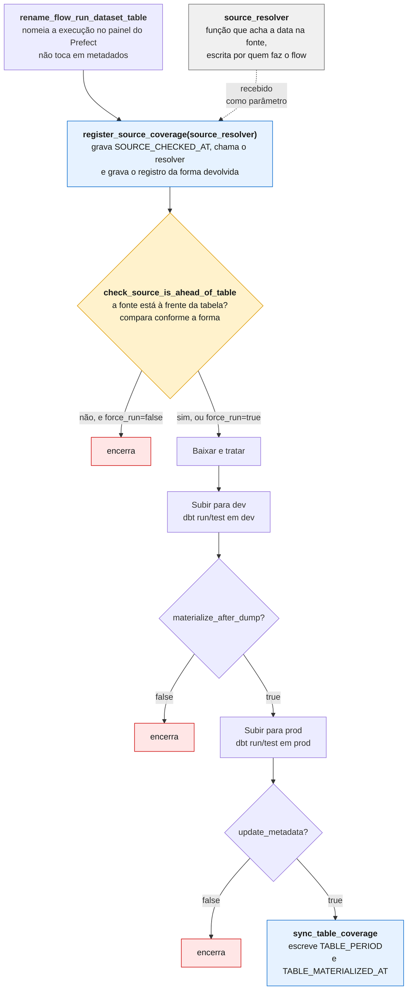
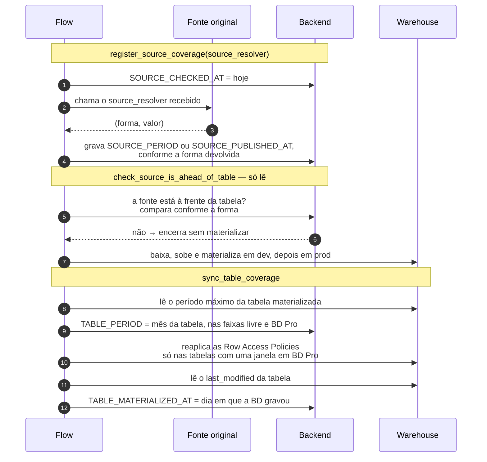

# Desenho do flow novo — as datas que ele lê e escreve

## Contexto

Este documento descreve o desenho do flow novo de atualização, a ser planejado e
implementado. Trata da parte que conversa com o backend de metadados: quais registros
o flow lê para decidir se roda, e quais ele escreve depois de materializar.

São cinco registros, e quatro deles guardam datas. As datas se parecem — todas são um
dia do calendário no banco — mas não significam a mesma coisa. Comparar duas de
significados diferentes produz uma decisão errada que não aparece no painel: o flow
encerra em estado concluído sem ter ingerido nada.

A distinção entre essas datas é o que organiza o desenho inteiro.

## A ideia central

### As duas espécies de data

| Espécie | O que é | Quando muda |
|---|---|---|
| **o mês do dado** | até onde a série vai | quando a fonte publica um período novo |
| **o dia em que algo aconteceu** | a fonte publicou, a BD gravou, nós olhamos | a cada acontecimento |

Cada campo do backend guarda uma das duas espécies, e só ela. Toda comparação é entre
campos da mesma espécie.

> A granularidade da primeira acompanha a da série — mês, dia, ano. "Mês do dado" é a
> forma curta; numa série anual, leia "ano do dado".

### Onde cada data mora

Cinco registros: três descrevem a fonte original, dois descrevem a tabela na BD. O
caminho de cada um no backend é longo e se repete, então cada registro recebe aqui um
nome próprio, usado no resto do documento:

| Nome | Espécie | Campo no backend |
|---|---|---|
| `SOURCE_PERIOD` | mês do dado | `RawDataSource.DatetimeRange` |
| `SOURCE_PUBLISHED_AT` | dia em que aconteceu | `RawDataSource.Update.latest` |
| `SOURCE_CHECKED_AT` | dia em que aconteceu | `Poll.latest` |
| `TABLE_PERIOD` | mês do dado | `Table.DatetimeRange` |
| `TABLE_MATERIALIZED_AT` | dia em que aconteceu | `Table.Update.latest` |

O sufixo carrega a espécie: `_PERIOD` guarda mês do dado, `_AT` guarda dia em que algo
aconteceu. Com isso a regra de só comparar iguais fica visível no próprio nome.



Terminada a materialização, os dois registros da tabela avançam: `TABLE_PERIOD`
alcança o mês que a fonte publicou, e `TABLE_MATERIALIZED_AT` recebe o dia da
gravação.

O que cada registro alimenta na página pública da tabela:

| Registro | Linha no site |
|---|---|
| `TABLE_MATERIALIZED_AT` | Última atualização na Base dos Dados |
| `SOURCE_PUBLISHED_AT` | Última atualização na fonte original |
| `SOURCE_CHECKED_AT` | Última verificação da fonte original |
| `TABLE_PERIOD` | o período dos dados, no topo da página |

Três deles são obrigatórios por regra de negócio — sem eles a publicação da tabela é
barrada:

| Registro | Regra, em `regras-metadados.md` |
|---|---|
| `TABLE_MATERIALIZED_AT` | Tables 02 — "Toda `Table` deve ter `last update`" |
| `SOURCE_PUBLISHED_AT` | RawDataSource 03 — "Toda `RawDataSource` deve ter `last update`" |
| `SOURCE_CHECKED_AT` | RawDataSource 02 — "Toda `RawDataSource` deve ter `poll`" |

### Os dois momentos de escrita

O flow escreve metadados em dois pontos, e a posição de cada um em relação à decisão
de rodar é deliberada.



O primeiro passo é de apresentação: renomeia a execução no painel do Prefect para
`Dump: <dataset>.<tabela>`, de modo que a lista de execuções seja legível. Não lê nem
escreve metadados.

O `source_resolver` é o único ponto escrito por quem desenvolve o flow — não é uma
etapa do desenho, e sim uma função que o flow passa adiante. O contrato dele está na
seção "Proposta — resolução de datas". Do resto do desenho para a frente é tudo
componente compartilhado.

**Os registros da fonte vêm antes da decisão.** Descrevem o que observamos, e a
observação aconteceu independentemente de haver novidade. Toda execução grava
`SOURCE_CHECKED_AT`, inclusive as que encerram sem fazer nada.

**Os registros da tabela vêm depois de materializar.** Descrevem o que a tabela tem, e
só podem avançar depois que o dado chegou lá. A decisão de rodar apenas lê: se o flow
quebra no meio, nenhum registro da tabela avançou e a execução seguinte tenta de novo.

### A sequência completa



`TABLE_MATERIALIZED_AT` vem do `last_modified` da tabela no warehouse, não da data em
que o flow rodou: assim, execução que não escreveu nada na tabela não anuncia
atualização.

## Proposta — resolução de datas

Achar a data na fonte é sempre potencialmente específico: o nome do arquivo, o nome da
pasta, uma coluna do próprio dado, um cabeçalho HTTP, o tamanho em bytes. Essa parte
não se encapsula — quem desenvolve o flow implementa, olhando o que a fonte dele
expõe.

O que se encapsula é o que fazer com o valor. A proposta é a função de escrita receber
um parâmetro `source_resolver`: uma função sem argumentos, escrita do lado do flow,
que devolve o valor encontrado junto com a forma como ele foi resolvido.

### As três formas

| Forma | O que a fonte fornece | Compara com |
|---|---|---|
| `period` | até que período publicou | `TABLE_PERIOD` |
| `publication` | dia em que publicou | `TABLE_MATERIALIZED_AT` |
| `size` | tamanho em bytes | último tamanho registrado |

Cada flow escolhe **uma** — a que a fonte dele suporta. As três comparam grandezas da
mesma espécie, que é a regra que organiza o desenho.

### O contrato

```python
Kind = Literal["period", "publication", "size"]
SourceSignal = tuple[Kind, date | int] | None
SourceResolver = Callable[[], SourceSignal]
```

`None` é a forma explícita de "olhamos e não havia o que resolver".

A forma vem no retorno, não num parâmetro à parte, porque ela é propriedade da
extração: quem escreveu o resolver sabe se leu um período do nome do arquivo ou um
`Last-Modified`. Separar os dois abriria espaço para um resolver de publicação
declarado como período.

### Resolvers prontos

O grau de reaproveitamento não é igual nas três.

**`publication` e `size` são protocolo padrão** e funcionam em qualquer fonte que o
fale:

```python
def resolve_publication() -> SourceSignal:
    response = requests.head(url)
    return "publication", parsedate_to_datetime(response.headers["Last-Modified"]).date()


def resolve_size() -> SourceSignal:
    response = requests.head(url)
    return "size", int(response.headers["Content-Length"])
```

O mesmo vale para `MDTM` no FTP e `getlastmodified` no WebDAV.

**`period` quase nunca é**, porque o período mora na convenção da fonte. O que dá para
deixar pronto é parametrizado:

```python
def resolve_period() -> SourceSignal:
    yyyymm = max(f[6:12] for f in files)
    return "period", datetime.strptime(yyyymm, "%Y%m").date()
```

Helpers como `period_from_filenames(files, regex, formato)` e
`period_from_column(df, coluna)` cobrem boa parte dos casos, mas sempre vai sobrar
fonte que não cabe — e é para isso que o parâmetro fica aberto.

### O despacho

Quem recebe o resolver desestrutura o par:

```python
match signal:
    case ("period", value):
        client.upsert_raw_source_period(dataset_id, table_id, end=value)
    case ("publication", value):
        client.upsert_raw_source_update(dataset_id, table_id, latest=value)
    case ("size", _):
        client.upsert_raw_source_update(dataset_id, table_id, latest=today())
    case None:
        pass
```

O gate tem a mesma estrutura, trocando a escrita pela comparação da tabela
correspondente. Acrescentar uma quarta forma é acrescentar uma etiqueta e um ramo em
cada — o flow e o resto do componente não mudam.

O `source_resolver` é chamado **depois** da gravação de `SOURCE_CHECKED_AT`, para que
uma resolução que quebre ainda deixe registrado que olhamos.

### Custo da resolução

Vale resolver sem baixar sempre que a fonte permitir — listagem de FTP, `HEAD`,
`PROPFIND`, índice do portal. Quando a resolução exige baixar o dado, o gate deixa de
poupar a coleta e passa a poupar só o upload, o dbt e a materialização. Continua
valendo, mas é bom não prometer o que não entrega.

### O que fica sem valor

A forma escolhida determina quais registros da fonte recebem valor real:

| Forma | `SOURCE_PERIOD` | `SOURCE_PUBLISHED_AT` |
|---|---|---|
| `period` | preenchido | sem valor |
| `publication` | sem valor | preenchido |
| `size` | sem valor | dia da detecção |

Falta decidir o que fazer com o que sobra vazio, porque isso aparece na página da
tabela. Nada impede aceitar mais de um resolver: uma fonte que exponha período e
publicação preencheria os dois.

## Sugestão — nomear as funções pelos registros que gravam

Os nomes das duas funções de escrita dizem "coverage", mas cada uma grava vários
registros, das duas espécies. O nome não descreve os campos que a função atualiza.

A proposta é nomear cada função pelo conjunto que ela grava, alinhando o prefixo do
nome ao prefixo das constantes:

| Nome atual | Proposta | Grava |
|---|---|---|
| `register_source_coverage` | `record_source_dates` | `SOURCE_PERIOD`, `SOURCE_PUBLISHED_AT`, `SOURCE_CHECKED_AT` |
| `sync_table_coverage` | `record_table_dates` | `TABLE_PERIOD`, `TABLE_MATERIALIZED_AT` |

`check_source_is_ahead_of_table` fica como está: já descreve o que faz, e não grava
nada.

Uma ressalva: além dos dois registros de data, `sync_table_coverage` reaplica as Row
Access Policies das tabelas com janela em BD Pro. Para o nome proposto ficar exato,
essa reaplicação passa a ser uma chamada própria no flow.

Os diagramas acima usam os nomes atuais.

## Limite conhecido

A decisão de rodar lê `TABLE_PERIOD`, e tabela sem faixa nenhuma é lida como "nunca
materializou" — o flow segue em frente. Uma tabela sem período declarado, marcada no
código como `NonHistorical` por não ter coluna de data confiável, também não tem faixa
por definição, e cairia nessa leitura em toda execução. Esse tipo de tabela precisa de
um critério de decisão próprio.

## Ver também

- `governanca/qualidade/referencia/regras-metadados.md`, no manual da equipe — as
  regras de negócio que cada registro atende
- `infraestrutura/prefect/como-fazer/registrar-metadados.md`, no manual da equipe — o
  modelo de dados do backend e o passo a passo de preenchimento
- `pipelines/utils/metadata/poll.py`, neste repositório — o ponto de implementação
